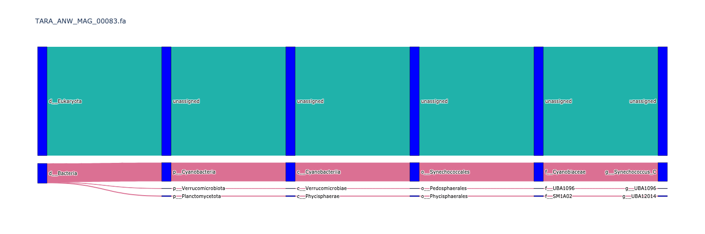
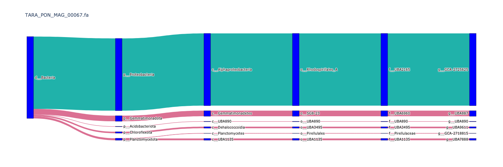
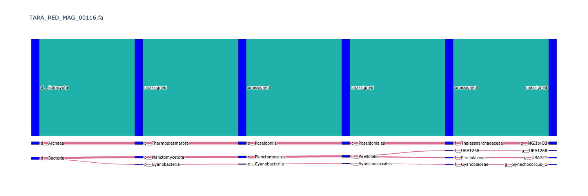

# Code for building Sankey or alluvial flow diagrams for genome contamination

See [charcoal #132](https://github.com/dib-lab/charcoal/issues/132) and [a twitter thread](https://twitter.com/BioMickWatson/status/1299365876421062656).

Note, the above binder is built off of the `render` branch.

## Some static diagrams

In the diagrams below, paths represent the lineage of contigs
aggregated to each taxonomic rank, scaled by approximate contig size.
The blue path is the path that matches the known genome lineage of the
full genome.

You can download
[sankey-diagrams.html](https://github.com/ctb/2020-charcoal-sankey/blob/latest/sankey-diagrams.html)
to get this in an interactive format.

### Contaminated genomes

This first GenBank genome is a mix of Archaea and Bacteria!

A mixture of firmicute and proteobacterial sequence in a GenBank genome.

Minimal phylum level mismatches, but lots of genus level mismatches in a
Genbank genome.

Bacterial contamination in a euk from some TARA MAGs.

Multiple different phyla in a single MAG (TARA).

Bacterial AND Archaeal contamination in a Euk (TARA).

