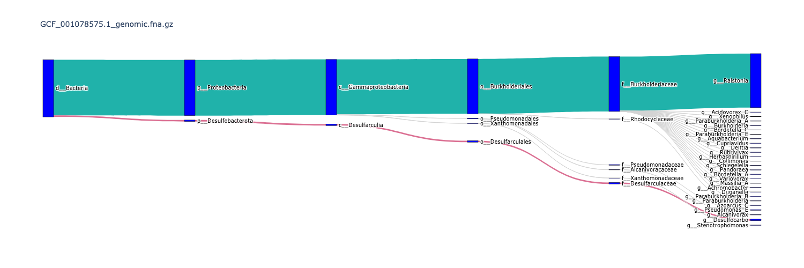
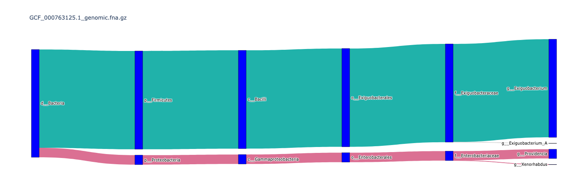

# Code for building Sankey or alluvial flow diagrams for genome contamination

See [charcoal #132](https://github.com/dib-lab/charcoal/issues/132) and [a twitter thread](https://twitter.com/BioMickWatson/status/1299365876421062656).

Note, the above binder is built off of the `render` branch.

## Some static diagrams

In the diagrams below, paths represent the lineage of contigs
aggregated to each taxonomic rank, scaled by approximate contig size.
The blue path is the path that matches the known genome lineage of the
full genome.

You can download
[sankey-diagrams.html](https://github.com/ctb/2020-charcoal-sankey/blob/latest/sankey-diagrams.html)
to get this in an interactive format.

### An example MAG with minimal contamination

### Contaminated genbank genomes

This first genome is a mix of Archaea and Bacteria!

Oh, hey, another mixture of archaea and bacteria!

Mixed phyla...

Mixed phyla again...

Mixed phyla again...

Mixed phyla again...

Mixed phyla...

Hmm, this looks suspicious...

Mixed phyla.

Mixed phyla...

Mixed phyla...

Mixed phyla...

Maybe a teensy bit of contamination?

More teensy bit of contamination.

Even more teensy bit of contamination.

Even yet more teensy bit of contamination.

